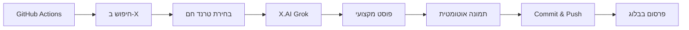

# 🤖 Automated Blog Setup Guide

## סקירה מהירה

מערכת בלוג אוטומטית שמפרסמת **3 פוסטים מקצועיים ביום** (בוקר, צהריים, ערב) עם:

✅ **חיפוש אמיתי ב-X (Twitter)** לטרנדים חמים
✅ **יצירת תוכן עם X.AI Grok** - פוסטים מקצועיים ב-AI
✅ **תמונות Hero אוטומטיות** עם X.AI
✅ **עיצוב מודרני** - Tailwind CSS + Prism.js
✅ **רספונסיבי 100%** - מותאם למובייל
✅ **GitHub Actions** - אוטומציה מלאה

---

## 📋 דרישות

### 1. API Keys נדרשים

| שירות | מטרה | קבל מ | סטטוס |
|-------|------|-------|--------|
| **X.AI API Key** | יצירת תוכן ותמונות | https://console.x.ai/ | ✅ חובה |
| **X Bearer Token** | חיפוש טרנדים ב-Twitter | https://developer.twitter.com/ | 🟡 מומלץ |
| **GitHub Token** | אוטומציה (Actions) | אוטומטי | ✅ מובנה |

### 2. חשבונות נדרשים

- ✅ **GitHub Account** (חינם)
- ✅ **X.AI Account** (יש free tier)
- 🟡 **X Developer Account** (אופציונלי - לטרנדים אמיתיים)

---

## ⚡ התקנה מהירה (5 דקות)

### שלב 1: קבל API Keys

#### A. X.AI API Key

```bash
# 1. לך ל: https://console.x.ai/
# 2. Login / Sign up
# 3. "Create API Key"
# 4. העתק את המפתח

export XAI_API_KEY="xai-your-key-here"
```

#### B. X Bearer Token (אופציונלי אבל מומלץ)

```bash
# 1. לך ל: https://developer.twitter.com/en/portal/dashboard
# 2. Create new project + app
# 3. Keys and Tokens → Generate Bearer Token
# 4. העתק

export X_BEARER_TOKEN="AAAAAAAAAAAAAAAAAAAAANRILgAA..."
```

### שלב 2: הגדר GitHub Secrets

```bash
# 1. לך לרפו שלך ב-GitHub:
#    https://github.com/YOUR_USERNAME/my-jekyll-blog

# 2. Settings → Secrets and variables → Actions

# 3. לחץ "New repository secret"

# 4. הוסף:
#    Name: XAI_API_KEY
#    Value: xai-your-key-here

# 5. הוסף גם (אופציונלי):
#    Name: X_BEARER_TOKEN
#    Value: AAAAAAAAAA...
```

### שלב 3: הפעל את ה-Workflow

```bash
cd ~/my-jekyll-blog

# Option 1: Commit and push (יפעיל אוטומטית)
git add .
git commit -m "🚀 Setup automated blog system"
git push

# Option 2: הפעלה ידנית
# לך ל: https://github.com/YOUR_USERNAME/my-jekyll-blog/actions
# בחר: "Daily Professional Blog Posts"
# לחץ: "Run workflow"
```

### שלב 4: בדוק שעובד

```bash
# לאחר 2-3 דקות, בדוק:
# https://github.com/YOUR_USERNAME/my-jekyll-blog/actions

# אמור לראות:
# ✅ "Morning/Afternoon/Evening Blog Update: 1 new professional post(s)"

# הפוסט יופיע ב:
# https://YOUR_USERNAME.github.io/my-jekyll-blog
```

---

## 🎯 איך זה עובד?

### תזמון אוטומטי

GitHub Actions מריץ את הסקריפט **3 פעמים ביום**:

| זמן | UTC | ישראל | סלוט |
|-----|-----|-------|------|
| 🌅 בוקר | 08:00 | 10:00 | Morning |
| ☀️ צהריים | 14:00 | 16:00 | Afternoon |
| 🌙 ערב | 20:00 | 22:00 | Evening |

### תהליך היצירה



### מה נוצר בכל פוסט?

1. **כותרת מרגשת** בעברית
2. **תוכן מקצועי** (1800-2500 מילים):
   - מבוא מעניין
   - 3-5 סעיפים ראשיים
   - **3+ דוגמאות קוד** (Python, JS, Bash)
   - Best practices
   - טיפים מעשיים
   - סיכום עם takeaways
3. **תמונת Hero** אוטומטית
4. **תגיות** רלוונטיות
5. **עיצוב מודרני** - Tailwind CSS

---

## 🔧 בדיקה מקומית

רוצה לבדוק לפני הדפלוי?

```bash
cd ~/my-jekyll-blog

# הגדר API keys
export XAI_API_KEY="xai-..."
export X_BEARER_TOKEN="AAAA..."

# הרץ את הסקריפט
python3 scripts/ai_trend_publisher_v2.py

# בדוק את התוצאה
ls -lt _posts/ | head -5

# הצג פוסט
cat _posts/2025-12-04-*.md | head -50
```

### יצירת תמונות ידנית

```bash
# למצוא פוסטים חדשים ללא תמונה
cd ~/my-jekyll-blog
grep -L "^image:" _posts/2025-12-*.md

# ליצור תמונה לפוסט מסוים
python3 scripts/generate_ai_image.py _posts/2025-12-04-my-post.md
```

---

## 📱 עיצוב Mobile-First

### מה תוקן?

#### ✅ כפתור תפריט בצד (לא באמצע)

```html
<!-- BEFORE (❌ באמצע) -->
<div class="flex justify-between">
  <logo>
  <button>☰</button>  <!-- באמצע! -->
</div>

<!-- AFTER (✅ בצד) -->
<div class="flex justify-between">
  <button>☰</button>  <!-- בצד! -->
  <logo>
  <spacer>
</div>
```

#### ✅ בלוקי קוד רספונסיביים

- גלילה אופקית במובייל
- פונט מותאם לגודל מסך
- כפתור העתקה גדול ונוח
- מספרי שורות ברורים

#### ✅ תמונות מותאמות

```css
/* Auto-responsive */
img {
  max-width: 100%;
  height: auto;
}
```

---

## 🎨 התאמה אישית

### שינוי צבעים

Edit `_layouts/post-modern.html`:

```javascript
tailwind.config = {
  theme: {
    extend: {
      colors: {
        primary: '#6366f1',    // שנה לצבע שלך
        secondary: '#8b5cf6',  // שנה לצבע משני
      }
    }
  }
}
```

### שינוי קטגוריות חיפוש

Edit `scripts/ai_trend_publisher_v2.py`:

```python
TECH_CATEGORIES = [
    ("your custom search", "קטגוריה בעברית"),
    ("another topic", "נושא נוסף"),
    # הוסף עוד...
]
```

### שינוי זמני פרסום

Edit `.github/workflows/daily_blog_publisher.yml`:

```yaml
schedule:
  - cron: '0 6 * * *'   # 6 AM UTC = 8 AM Israel (בוקר)
  - cron: '0 12 * * *'  # 12 PM UTC = 2 PM Israel (צהריים)
  - cron: '0 18 * * *'  # 6 PM UTC = 8 PM Israel (ערב)
```

---

## 📊 ניטור ובקרה

### צפייה ב-Logs

```bash
# GitHub Actions:
https://github.com/YOUR_USERNAME/my-jekyll-blog/actions

# לחץ על run אחרון → "generate-blog-post" → "Generate professional blog post"
```

### בדיקת סטטיסטיקות

```bash
cd ~/my-jekyll-blog

# כמה פוסטים נוצרו?
ls _posts/*.md | wc -l

# פוסטים האחרונים
ls -lt _posts/*.md | head -5

# פוסטים מהיום
ls -lt _posts/$(date +%Y-%m-%d)*.md
```

### עצירת הרצה אוטומטית

```bash
# Option 1: Disable workflow
# GitHub → Settings → Actions → General
# → "Disable actions for this repository"

# Option 2: עריכת הקובץ
# .github/workflows/daily_blog_publisher.yml
# הוסף שורה בהתחלה: # disabled: true
```

---

## 🐛 פתרון בעיות

### בעיה: Workflow נכשל

**תסמינים**: ❌ ב-GitHub Actions

**בדיקה**:

```bash
# 1. בדוק Secrets
GitHub → Settings → Secrets → Actions
# וודא ש-XAI_API_KEY קיים

# 2. בדוק logs
Actions → failed run → expand steps

# 3. הרץ מקומית
python3 scripts/ai_trend_publisher_v2.py
```

**פתרונות נפוצים**:

```bash
# Missing API key
# → הוסף ב-GitHub Secrets

# X.AI API rate limit
# → חכה שעה או שדרג תוכנית

# JSON parse error
# → הסקריפט יטפל בזה אוטומטית

# Git push failed
# → בדוק הרשאות ב-Settings → Actions → General
#   → "Read and write permissions"
```

### בעיה: פוסטים זהים

**תסמינים**: אותה כותרת/תוכן

**פתרון**:

```python
# הסקריפט החדש פותר את זה!
# הוא משתמש ב:
# 1. random.sample() - 3 קטגוריות שונות
# 2. X API real-time - טרנדים אמיתיים
# 3. Timestamps - כל פוסט עם שעה שונה
```

### בעיה: תמונות לא נוצרות

**תסמינים**: `generate_image: true` אבל אין תמונה

**פתרון**:

```bash
# 1. יצירה ידנית
python3 scripts/generate_ai_image.py _posts/YOUR-POST.md

# 2. בדוק quota
# X.AI Console → Usage

# 3. החלף ל-URL ידני
# frontmatter:
image: https://unsplash.com/your-image.jpg
```

### בעיה: Mobile menu לא עובד

**תסמינים**: לחיצה על ☰ לא עובדת

**פתרון**:

```html
<!-- וודא שה-JavaScript נטען -->
<script>
  const mobileMenuBtn = document.getElementById('mobile-menu-btn');
  const mobileMenu = document.getElementById('mobile-menu');

  if (mobileMenuBtn && mobileMenu) {
    mobileMenuBtn.addEventListener('click', () => {
      mobileMenu.classList.toggle('hidden');
    });
  }
</script>
```

---

## 🚀 Deployment

### GitHub Pages

```bash
# 1. Settings → Pages
# 2. Source: "GitHub Actions"
# 3. או "Deploy from branch" → main → /root

# 4. אתר יהיה זמין ב:
# https://YOUR_USERNAME.github.io/my-jekyll-blog
```

### Custom Domain

```bash
# 1. הוסף קובץ CNAME
echo "yourdomain.com" > CNAME
git add CNAME
git commit -m "Add custom domain"
git push

# 2. הגדר DNS:
# Type: CNAME
# Name: blog (או www)
# Value: YOUR_USERNAME.github.io
```

---

## 📈 שיפורים עתידיים

### רעיונות להרחבה

```bash
# 1. Email notifications
# הוסף ל-workflow:
- uses: dawidd6/action-send-mail@v3
  with:
    subject: New blog post published!

# 2. Social media auto-post
# אינטגרציה עם X, LinkedIn

# 3. Analytics
# Google Analytics / Plausible

# 4. Comments
# Utterances / Disqus

# 5. Newsletter
# Mailchimp / ConvertKit integration

# 6. Multi-language
# אנגלית + עברית בו-זמנית
```

---

## 💡 טיפים מקצועיים

### 1. אופטימיזציה של API Costs

```python
# השתמש ב-cache:
# - שמור topics שנבדקו היום
# - אל תקרא לAPI פעמיים על אותו טרנד
# - השתמש ב-fallback topics כשאין קרדיט
```

### 2. SEO Optimization

```yaml
---
# הוסף meta tags:
keywords: [ai, tech, hebrew, blog]
og_image: /assets/images/og-default.jpg
canonical_url: https://yourblog.com/post
---
```

### 3. Performance

```html
<!-- Lazy load images -->


<!-- Preload critical assets -->
<link rel="preload" href="/assets/css/main.css" as="style" />
```

### 4. Monitoring

```bash
# Setup uptime monitoring:
# - UptimeRobot (חינם)
# - Pingdom
# - StatusCake

# Monitor:
# - Site availability
# - Action success rate
# - Post quality
```

---

## 📞 תמיכה

### משאבים

- 📚 [Tailwind CSS Docs](https://tailwindcss.com/docs)
- 🤖 [X.AI API Docs](https://docs.x.ai/)
- 🐦 [X API Docs](https://developer.twitter.com/en/docs)
- 🎨 [Prism.js Docs](https://prismjs.com/)
- 📖 [Jekyll Docs](https://jekyllrb.com/docs/)

### קהילה

- GitHub Discussions
- Twitter: #jekyll #jamstack
- Discord: Jekyll community

---

## ✅ Checklist סופי

לפני השקה, וודא:

- [ ] ✅ XAI_API_KEY מוגדר ב-GitHub Secrets
- [ ] ✅ X_BEARER_TOKEN מוגדר (אופציונלי)
- [ ] ✅ Workflow file במקום (`.github/workflows/daily_blog_publisher.yml`)
- [ ] ✅ Scripts עם הרשאות הרצה (`chmod +x scripts/*.py`)
- [ ] ✅ `_layouts/post-modern.html` קיים ועובד
- [ ] ✅ Mobile menu תוקן (כפתור בצד)
- [ ] ✅ GitHub Pages מופעל
- [ ] ✅ בדיקה ידנית עובדת (`python3 scripts/ai_trend_publisher_v2.py`)
- [ ] ✅ פוסט לדוגמה נוצר ונראה טוב
- [ ] ✅ Responsive design עובד (בדוק במובייל)

---

## 🎉 סיום

**מזל טוב!** עכשיו יש לך:

✅ בלוג מודרני ומקצועי
✅ 3 פוסטים חדשים ביום אוטומטית
✅ תוכן איכותי עם AI
✅ עיצוב מושלם למובייל
✅ אוטומציה מלאה עם GitHub Actions

**הבלוג שלך מפרסם בעצמו! 🚀**

---

*נוצר: {{ 'now' | date: "%d %B %Y" }}*
*גרסה: 2.0*
